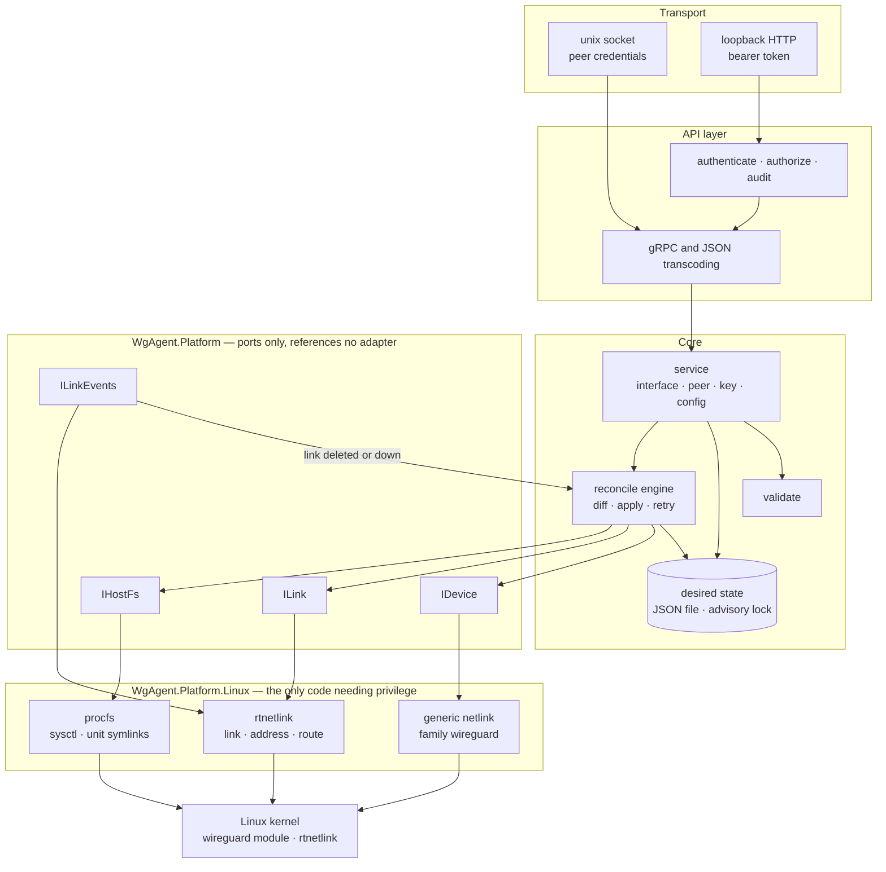
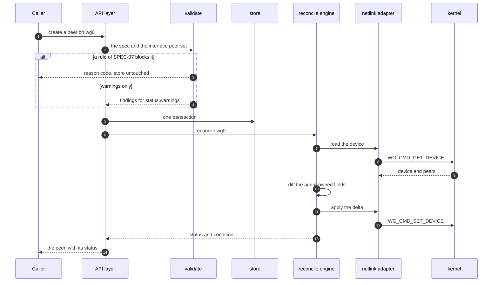

# Architecture

## Layers

The dependency points inwards. `WgAgent.Platform` declares the ports and references no
adapter, which is what keeps every layer above it testable without privilege.



## The lifecycle of one write

Every write follows the same order. Validation precedes the store so `REQ-VAL-001` cannot
be bypassed, and reconciliation precedes the response so the status describes the change
the caller made rather than the state before it.



Reading the kernel before writing is what makes a pass a diff rather than an overwrite.
`REQ-RCN-012` forbids treating a kernel-owned field as drift, and `REQ-RCN-051` forbids
overwriting an endpoint the kernel learned. The five events that start a pass are listed
in [SPEC-03](../20-spec/SPEC-03-state-reconcile.md) under `REQ-RCN-020`; an API write is
one of them, which is why the sequence above ends inside the engine rather than beside it.

## Kernel interfaces

This boundary is the most commonly misunderstood part of the design. The WireGuard module
exposes **generic netlink only** — it configures a device and its peers, and cannot create
a network interface. Creating links, assigning addresses, setting the MTU and adding
routes all belong to **rtnetlink**, a different family on a different socket.

| Operation | Family | Message |
|---|---|---|
| Create / delete interface | rtnetlink | `RTM_NEWLINK` with `IFLA_INFO_KIND` of `wireguard`, `RTM_DELLINK` |
| Up / down, MTU | rtnetlink | `RTM_SETLINK` |
| Add / remove addresses | rtnetlink | `RTM_NEWADDR`, `RTM_DELADDR`, `RTM_GETADDR` |
| Routes for `allowed_ips` | rtnetlink | `RTM_NEWROUTE`, `RTM_DELROUTE`, `RTM_GETROUTE` |
| Link event subscription | rtnetlink | multicast group `RTNLGRP_LINK` |
| Private key, listen port, fwmark | generic netlink | `WG_CMD_SET_DEVICE` |
| Add / update / remove peers | generic netlink | `WG_CMD_SET_DEVICE` with `WGDEVICE_A_PEERS` |
| Read device, peers and counters | generic netlink | `WG_CMD_GET_DEVICE` |
| Per-interface forwarding | procfs | `/proc/sys/net/ipv4/conf/<iface>/forwarding` |
| Forward policy, NAT | nfnetlink | deferred under `B-04` |

The family id of `wireguard` is resolved at run time through `CTRL_CMD_GETFAMILY`. The
kernel assigns it, so it is not a constant.

**Invariant:** no child process in a production path — `REQ-SEC-041`. A node therefore
needs the kernel module and the agent binary, and neither `wg`, `ip`, `bash` nor
`iproute2` at run time.

## Managed dependencies

| Concern | Choice |
|---|---|
| Netlink sockets | Hand-written over `socket(2)` from libc. Everything above the file descriptor is managed |
| X25519 public-key derivation | `BouncyCastle.Cryptography`. No .NET release through 10 exposes the curve |
| Key generation | `RandomNumberGenerator`, with Curve25519 clamping applied at generation |
| Configuration file | A YAML reader decoding strictly, so `REQ-CFG-002` refuses an unrecognized key |
| gRPC and JSON transcoding | ASP.NET Core, which reads the `google.api.http` annotations the contract already carries |

## Repository layout

```
api/proto/wgagent/v1/         .proto — source of truth for the API contract
src/
  WgAgent.Platform/           ports and the types crossing them; references no adapter
  WgAgent.Platform.Linux/     netlink and procfs adapters; the only privileged code
  WgAgent.Core/               model, store, validate, reconcile
  WgAgent.Service/            business logic: interface, peer, key, config, diagnose
  WgAgent.Api/                gRPC services, transcoding, listeners, authentication
  WgAgent.Cli/                entrypoint and subcommands per SPEC-12
tests/
  WgAgent.Testing/            the in-memory platform, shared by the test projects
  WgAgent.Tests/              unit tier — no privilege
  WgAgent.IntegrationTests/   real kernel, CAP_NET_ADMIN
packaging/systemd/            unit, sysusers, tmpfiles
docs/                         documentation — start at docs/README.md
```

## Spec module to project mapping

| Spec | Primary projects |
|---|---|
| [SPEC-01](../20-spec/SPEC-01-resource-model.md) Resource model | `api/proto`, `WgAgent.Core`, `WgAgent.Service` |
| [SPEC-02](../20-spec/SPEC-02-forward-policy.md) Forward policy | `WgAgent.Platform.Linux` |
| [SPEC-03](../20-spec/SPEC-03-state-reconcile.md) State and reconcile | `WgAgent.Core` |
| [SPEC-04](../20-spec/SPEC-04-api-conventions.md) API conventions | `WgAgent.Api` |
| [SPEC-05](../20-spec/SPEC-05-security.md) Security | `WgAgent.Api` |
| [SPEC-06](../20-spec/SPEC-06-key-management.md) Key management | `WgAgent.Platform`, `WgAgent.Service` |
| [SPEC-07](../20-spec/SPEC-07-validation.md) Validation | `WgAgent.Core` |
| [SPEC-08](../20-spec/SPEC-08-observability.md) Observability | `WgAgent.Api` |
| [SPEC-09](../20-spec/SPEC-09-config-deployment.md) Configuration and deployment | `WgAgent.Cli`, `packaging/` |
| [SPEC-10](../20-spec/SPEC-10-lifecycle.md) Lifecycle | `WgAgent.Core`, `WgAgent.Cli` |
| [SPEC-11](../20-spec/SPEC-11-diagnostics.md) Diagnostics | `WgAgent.Service` |

## Test strategy

| Level | Approach |
|---|---|
| Unit | The ports of `WgAgent.Platform` are the seam: adapters implement them against the kernel, `WgAgent.Testing` implements them in memory, and nothing above that layer needs privilege |
| Integration | Real WireGuard inside a dedicated network namespace. A container supplies one, along with a pinned `wg` and `ip` for test setup and the .NET SDK — see [running the tests](../50-guides/running-tests.md) |
| Privileged | The tier where `/proc/sys` is writable, which is the only place the forwarding sysctl of `REQ-FWD-020` can be verified |
| Reconcile | Inject drift by hand — delete a link, add a foreign peer, change the MTU — and assert convergence |
| Roaming | Change a peer endpoint externally and assert reconcile does not overwrite it (`REQ-RCN-051`) |
| Concurrency | Concurrent writers on one interface; assert the serialization `REQ-RCN-042` requires |
| Security | Scan every response, log and audit record for leaked secrets (`REQ-SEC-051`) |
| Compatibility | CI matrix: Debian 11/12/13, Ubuntu 20.04/22.04/24.04 |

Every test names the REQ ID it verifies, per the convention in
[20-spec/README.md](../20-spec/README.md).
