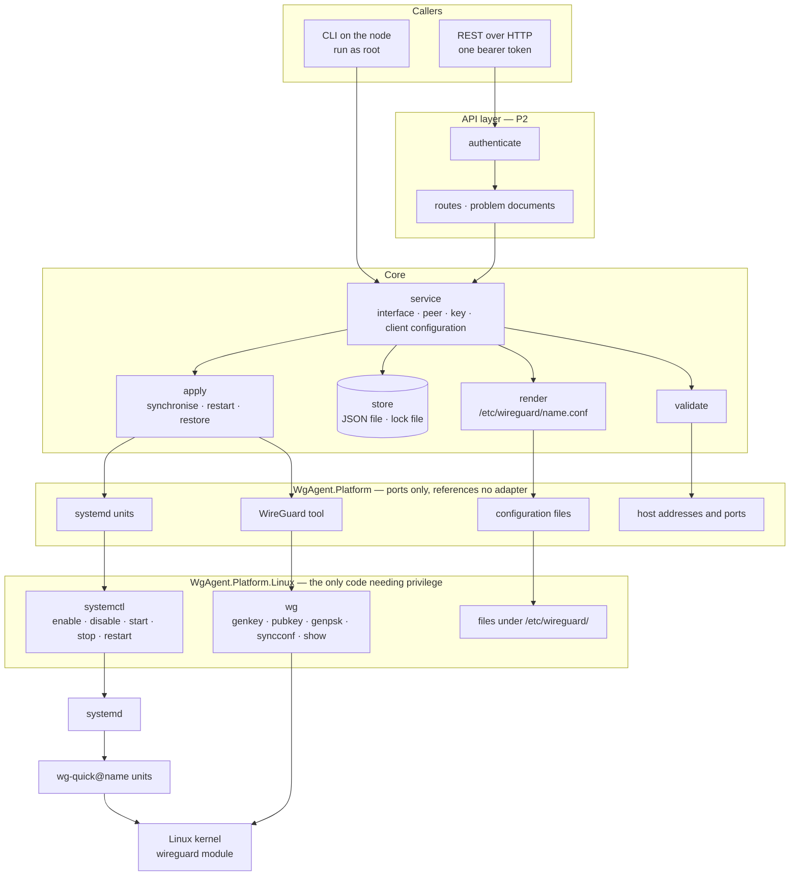
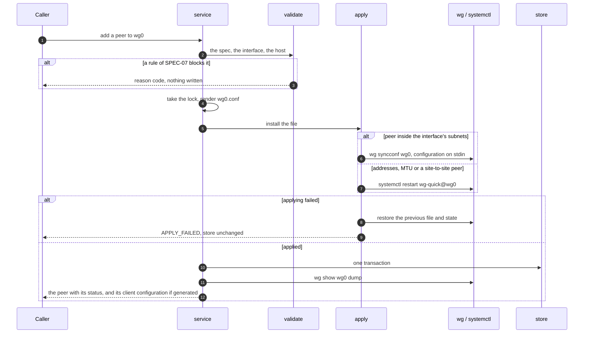

# Architecture

The first release is a wrapper over `wg` and `wg-quick` —
[ADR-0013](../10-decisions/ADR-0013-drive-wg-and-wg-quick.md). This page describes that
wrapper; the control plane the backlog describes grows from it.

## Layers

The dependency points inwards. `WgAgent.Platform` declares the ports and references no
adapter, which is what keeps every layer above it testable without privilege.



The CLI calls the service in its own process rather than through the API (`REQ-CLI-002`), so it
works before the daemon runs, and the one lock of `REQ-RCN-042` keeps the two writers apart.

## The lifecycle of one write

Validation precedes everything so `REQ-VAL-001` cannot be bypassed. The store is written last,
once the change has taken effect, so it never describes a configuration that failed
(`REQ-API-020`, `REQ-APL-008`).



## Operations and the programs behind them

| Operation | Mechanism |
|---|---|
| Create an interface | Write `/etc/wireguard/<name>.conf`; `systemctl enable --now wg-quick@<name>` |
| Delete an interface | `systemctl disable --now wg-quick@<name>`; remove the file |
| `enabled` false or true | `systemctl disable --now` or `enable --now` |
| Add, change or remove a peer | Rewrite the file; `wg syncconf <name> /dev/stdin` |
| Change addresses or MTU, or a site-to-site peer | Rewrite the file; `systemctl restart wg-quick@<name>` |
| Read status | `wg show <name> dump`; the unit's active state |
| Generate keys and the token | `wg genkey`, `wg pubkey`, `wg genpsk` — keys only on stdin and stdout |
| Ports held by other interfaces | `wg show all listen-port` |
| Addresses held by other interfaces | Read in-process from the host's interface list |

**Invariant:** `wg` and `systemctl` are the only child processes, started with fixed argument
vectors and never through a shell — `REQ-SEC-087` to `REQ-SEC-089`. `wg-quick` itself runs in its
systemd unit, outside the agent's sandbox. No rendered file carries a hook (`REQ-APL-003`).

## Managed dependencies

| Concern | Choice |
|---|---|
| Child processes | `System.Diagnostics.Process`, fixed argument vectors, secrets on stdin |
| HTTP | ASP.NET Core Minimal APIs with source-generated JSON — no trim or AOT warning when measured |
| Store and token file | Source-generated `System.Text.Json` |
| Configuration file | A hand-written reader for `KEY=VALUE` lines, refusing an unrecognised key (`REQ-CFG-002`) |
| Cryptography | None: keys and the token come from `wg`, which draws on the kernel's generator |

## Repository layout

The target structure. A project is created when the first module that needs it is
implemented, so a directory below may not exist yet.

```
api/openapi.yaml              the API contract — ADR-0014; written at the start of P2
src/
  WgAgent.Platform/           ports and the types crossing them; references no adapter
  WgAgent.Platform.Linux/     wg and systemctl, files under /etc/wireguard/; the only privileged code
  WgAgent.Core/               model, store, lock, validate, render, apply
  WgAgent.Service/            operations: interface, peer, key, client configuration
  WgAgent.Api/                HTTP listener, token, routes, problem documents
  WgAgent.Cli/                entrypoint and subcommands per SPEC-12
tests/
  WgAgent.Testing/            the in-memory platform, shared by the test projects
  WgAgent.Tests/              unit tier — no privilege
  WgAgent.IntegrationTests/   wg and wg-quick in a container
packaging/                    the .deb and its systemd unit — P3
docs/                         documentation — start at docs/README.md
```

## Spec module to project mapping

| Spec | Primary projects |
|---|---|
| [SPEC-01](../20-spec/SPEC-01-resource-model.md) Resource model | `WgAgent.Core`, `WgAgent.Service` |
| [SPEC-03](../20-spec/SPEC-03-state-reconcile.md) Store and lock | `WgAgent.Core` |
| [SPEC-04](../20-spec/SPEC-04-api-conventions.md) API conventions | `api/openapi.yaml`, `WgAgent.Api` |
| [SPEC-05](../20-spec/SPEC-05-security.md) Security | `WgAgent.Api`, `WgAgent.Platform.Linux` |
| [SPEC-06](../20-spec/SPEC-06-key-management.md) Keys and client configuration | `WgAgent.Service`, `WgAgent.Platform.Linux` |
| [SPEC-07](../20-spec/SPEC-07-validation.md) Validation | `WgAgent.Core` |
| [SPEC-08](../20-spec/SPEC-08-observability.md) Logs | `WgAgent.Api`, `WgAgent.Cli` |
| [SPEC-09](../20-spec/SPEC-09-config-deployment.md) Configuration and deployment | `WgAgent.Cli`, `packaging/` |
| [SPEC-12](../20-spec/SPEC-12-cli.md) CLI | `WgAgent.Cli` |
| [SPEC-13](../20-spec/SPEC-13-applying-changes.md) Applying a change | `WgAgent.Core`, `WgAgent.Platform.Linux` |

SPEC-02, SPEC-10 and SPEC-11 are in the [backlog](../60-planning/backlog.md) and map to no
project yet.

## Test strategy

| Level | Approach |
|---|---|
| Unit | The ports of `WgAgent.Platform` are the seam: adapters implement them with `wg`, `systemctl` and files, `WgAgent.Testing` implements them in memory, and nothing above that layer needs privilege |
| Integration | `wg` and `wg-quick` in a container, with two network namespaces joined by a veth pair so a peer really handshakes — the arrangement that measured `REQ-APL-005` — see [running the tests](../50-guides/running-tests.md) |
| Concurrency | The CLI and the daemon writing at once; assert the serialisation `REQ-RCN-042` requires |
| Security | Scan every response and log for leaked secrets (`REQ-SEC-051`), and every child process's argument vector for a key (`REQ-SEC-089`) |
| Packaging | The `.deb` under each supported distribution's own systemd as PID 1 — P3 |
| Compatibility | Debian 13 and Ubuntu 24.04, and the later stable and LTS releases |

Every test names the REQ ID it verifies, per the convention in
[20-spec/README.md](../20-spec/README.md).
