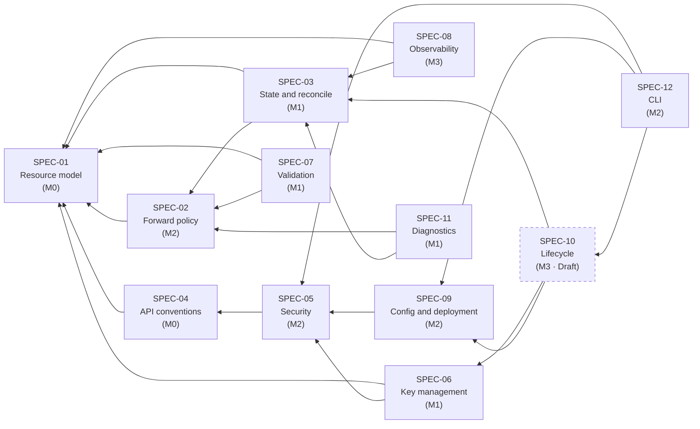

# Normative specification

> **This is the source of truth.** When any other document disagrees with this directory,
> this directory wins and the other document is the bug.

## How to read

### Normative keywords

Per RFC 2119, uppercase and in English so they stand apart from surrounding prose.

| Keyword | Meaning |
|---|---|
| **MUST** / **MUST NOT** | Absolute requirement. Violation is an implementation defect |
| **SHOULD** / **SHOULD NOT** | Strong recommendation. Deviation requires a recorded reason |
| **MAY** | Genuinely optional |

A sentence without a keyword is **explanatory**, not normative. Implementation never
follows explanatory prose — a behavior described only in prose is a spec defect and should
be reported.

### Identified requirements

Every normative statement carries a stable ID of the form `REQ-<AREA>-<NNN>` and is
presented like this:

> **REQ-XXX-001** — When `intra_interface = DENY`, the agent MUST drop packets whose input
> and output interface are both that interface.

The example above deliberately uses the placeholder area `XXX`: a real ID in a guidance
document would register as a duplicate definition.

Each requirement is **atomic** — one sentence, exactly one keyword — so it maps one-to-one
onto tests. Numbering rules are in [docs/README.md §5.4](../README.md): never reuse, never
reassign; dropped requirements are struck through rather than deleted.

### Traceability

| Direction | Method |
|---|---|
| Requirement → implementation | Grep the ID in the source tree |
| Requirement → test | Test names embed the ID: `TestForwardPolicy_IntraDeny_REQ_FWD_012` |
| Code → reason it exists | A comment cites the ID, the ID leads to the spec, the spec leads to an ADR |

CI verifies two properties: every ID referenced in code exists in the spec, and every
requirement marked `Implemented` has at least one referencing test.

## Module index

| ID | Module | Prefix | Status | Milestone |
|---|---|---|---|---|
| [SPEC-01](SPEC-01-resource-model.md) | Resource model | `RES` | Accepted | M0 |
| [SPEC-02](SPEC-02-forward-policy.md) | Forward policy and NAT | `FWD` | Accepted | M2, NAT at M4 |
| [SPEC-03](SPEC-03-state-reconcile.md) | Desired state and reconcile | `RCN` | Accepted | M1 |
| [SPEC-04](SPEC-04-api-conventions.md) | API conventions, concurrency, errors | `API` | Accepted | M0 |
| [SPEC-05](SPEC-05-security.md) | Security, authentication, authorization | `SEC` | Accepted | M2 |
| [SPEC-06](SPEC-06-key-management.md) | Key management | `KEY` | Accepted | M1 |
| [SPEC-07](SPEC-07-validation.md) | Validation | `VAL` | Accepted | M1 |
| [SPEC-08](SPEC-08-observability.md) | Metrics, logs, audit | `OBS` | Accepted | M3 |
| [SPEC-09](SPEC-09-config-deployment.md) | Configuration, packaging, deployment | `CFG` | Accepted | M2 |
| [SPEC-10](SPEC-10-lifecycle.md) | Lifecycle: upgrade, backup, DR | `LIF` | **Draft** | M3 |
| [SPEC-11](SPEC-11-diagnostics.md) | Diagnostics and node overview | `DIA` | Accepted | M1 |
| [SPEC-12](SPEC-12-cli.md) | Command line surface | `CLI` | Accepted | M2 |

SPEC-10 remains `Draft`. Three of its decisions are unsettled — export encryption, partial
import and downward migration — and all three sit at M3, outside the MVP. Approving a module
whose own text says *Undecided* would drain the status vocabulary of meaning, so it waits for
those answers. Every module the MVP depends on is `Accepted`.

## Dependency graph

Derived from the `depends_on` front-matter of each module. An arrow points from a module to the
one it depends on, so anything with no outgoing arrow can be read first.

SPEC-01 and SPEC-04 carry no dependency, which is why both sit at M0. The one dashed edge is
worth noticing: SPEC-12 is `Accepted` and depends on SPEC-10, which is `Draft`. Section 2 of
[SPEC-12](SPEC-12-cli.md) scopes the two subcommands that reach into SPEC-10 out of the MVP, so
the dependency does not block the milestone — but it is the one place the module graph crosses a
status boundary.

## Module boundaries

To prevent duplication, each topic has exactly one home:

| Topic | Belongs to | Does not belong to |
|---|---|---|
| Interface and peer fields | SPEC-01 | — |
| Default field values | SPEC-01 | SPEC-09 (which covers overriding only) |
| nftables rules, sysctl | SPEC-02 | SPEC-03 (which only invokes them) |
| Reconcile algorithm | SPEC-03 | — |
| Field ownership during reconcile | SPEC-03 | SPEC-01 |
| RPC shapes, error codes, revisions | SPEC-04 | — |
| Listeners, authentication, roles | SPEC-05 | SPEC-09 (which covers configuration only) |
| Key generation, rotation, storage | SPEC-06 | — |
| Validation rules and severities | SPEC-07 | Other modules reference only |
| Metric names, log fields | SPEC-08 | — |
| Configuration keys, systemd, packaging, install script | SPEC-09 | SPEC-12 (which covers commands only) |
| Backup, upgrade, migration | SPEC-10 | — |
| Adoption and release of an existing interface | SPEC-03 | SPEC-10 (which covers import of an export file only) |
| Diagnostic check list, node overview | SPEC-11 | SPEC-08 (which covers continuous signals) |
| CLI subcommands, token issuance | SPEC-12 | SPEC-05 (which covers token semantics) |

When the correct module is unclear, place the requirement where a reader would look first
and cross-reference from the other location.
