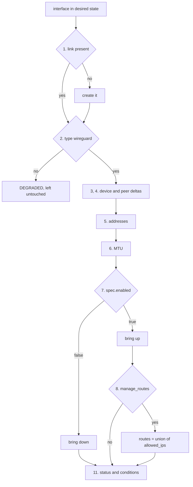
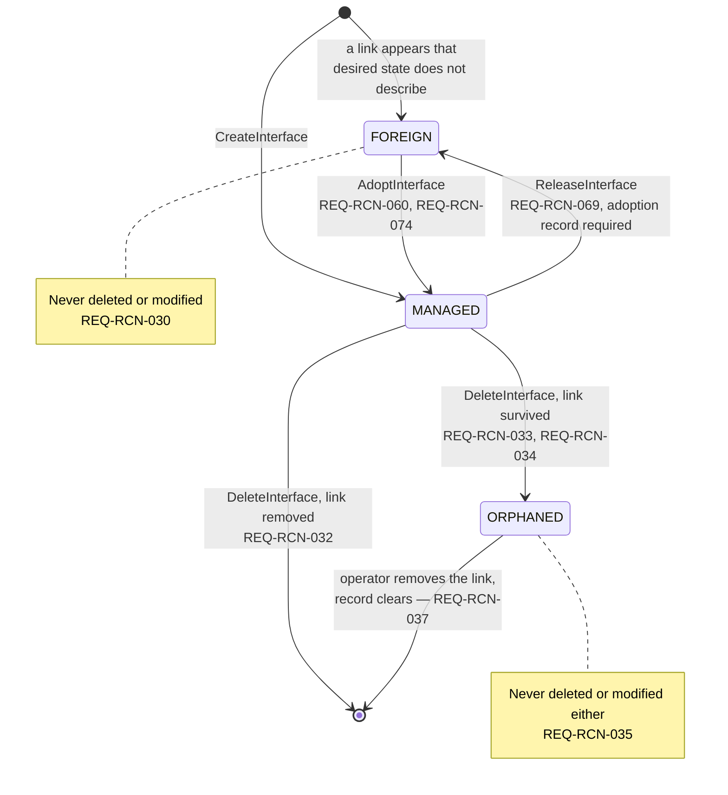

# SPEC-03: Desired state and reconcile

## 1. Scope

Durable storage of desired state and the lock every writer takes; the reconcile algorithm, and
**field ownership** — which fields the agent enforces and which the kernel owns.

Under [ADR-0013](../10-decisions/ADR-0013-drive-wg-and-wg-quick.md) a change reaches WireGuard
when it is written, through `wg` and `wg-quick`, as [SPEC-13](SPEC-13-applying-changes.md)
specifies. Continuous reconciliation — sections 3 to 5 and the error handling of section 8 — and
adoption in section 6.3 are delivered after that; the [roadmap](../60-planning/roadmap.md) and
the [backlog](../60-planning/backlog.md) hold the split.

**Not in this module:**
- How a change reaches WireGuard — files, units, synchronisation → [SPEC-13](SPEC-13-applying-changes.md)
- Backup, restore, upgrade migration → [SPEC-10](SPEC-10-lifecycle.md)
- Specific nftables rules → [SPEC-02](SPEC-02-forward-policy.md)
- Drift metrics → [SPEC-08](SPEC-08-observability.md)

## 2. Store

> **REQ-RCN-001** — The agent MUST persist desired state to disk and restore it on startup.

> **REQ-RCN-002** — The store MUST hold only `spec` values, `instance_id`, `created_at`,
> `revision`, the deletion records defined in section 6 and the adoption records defined in
> section 6.3.

`revision` is stored rather than derived. Deriving it from the spec — a hash, say — would make a
spec changed from A to B and back to A reproduce its earlier value, and `REQ-API-031` would then
accept a write from a caller holding a stale read. A stored value that only ever moves forward
has no such case.

> **REQ-RCN-050** — The store MUST NOT hold `status` values or any traffic counter.

> **REQ-RCN-003** — Every store write MUST occur inside a transaction.

> **REQ-RCN-004** — The store file MUST have mode `0600` and be owned by the account
> running the agent.

> **REQ-RCN-005** — On encountering a schema version newer than it understands, the agent
> MUST refuse to start with a clear message rather than misinterpreting the data.

> **REQ-RCN-042** — The agent MUST serialise every operation that writes the store or an
> interface's configuration behind one exclusive lock, held on a file that is never renamed.

The CLI writes beside a running agent (`REQ-CLI-002`), so without the lock two writers interleave
and one renders a configuration from a store the other has already changed. One lock for the
node, rather than one per interface, keeps the rule obvious at the scale of a single node.

An advisory lock on a file of its own is preferred to asking whether the agent is running. It
guards the resource rather than a proxy for it, so it also serialises two commands against each
other, and the kernel releases it when a holder dies — a socket or a pid file left behind by a
crash answers the question wrongly. The file is not the store: the store is replaced by rename,
and a lock held on it would sit on an inode the next rename discards.

> **REQ-RCN-075** — A writer that cannot take the lock of `REQ-RCN-042` within `apply_timeout`
> MUST give up with `STORE_BUSY`.

A CLI command meeting a write of the running agent waits for it rather than failing, because the
other write is short; a lock held longer than any write takes means something is stuck, and the
caller hears so instead of hanging.

Implementation: a single file written atomically — rendered to a temporary path in the same
directory, synced, and renamed over the original — which meets `REQ-RCN-001` to `REQ-RCN-005`
without a database engine. The rename is what makes a write all or nothing.

## 3. Field ownership

This is the most defect-prone part of the declarative model. Without an explicit
classification, reconciliation destroys runtime behavior established by the kernel.

> **REQ-RCN-010** — Every spec field MUST be classified as either agent-owned or
> kernel-owned.

| Class | Meaning | Reconcile behavior |
|---|---|---|
| **agent-owned** | The agent is the source of truth | Enforced on **every** reconcile; a difference is drift |
| **kernel-owned** | The kernel updates it at runtime | Written only when the **spec changes**; a difference is not drift |

| Field | Class |
|---|---|
| `private_key`, `listen_port`, `fwmark` | agent-owned |
| `addresses`, `mtu`, `enabled` | agent-owned |
| `allowed_ips`, `preshared_key`, `persistent_keepalive` | agent-owned |
| `forward_policy`, `nat` | agent-owned |
| **`endpoint`** | **kernel-owned** |

> **REQ-RCN-011** — The agent MUST enforce every agent-owned field on each reconcile pass.

> **REQ-RCN-012** — The agent MUST NOT treat a difference in a kernel-owned field as drift.

> **REQ-RCN-013** — The agent MUST apply `spec.endpoint` only at peer creation or when that
> field changes in the spec.

> **REQ-RCN-051** — Reconcile MUST NOT overwrite an endpoint the kernel has learned.

`REQ-RCN-013` and `REQ-RCN-051` exist to preserve **roaming**. WireGuard learns a peer's
endpoint from a valid handshake, which is what lets a client move from WiFi to cellular
without losing the tunnel. Treating an endpoint difference as drift and rewriting it every
cycle would disconnect roaming clients repeatedly, with a symptom that is very hard to
trace.

## 4. Reconcile triggers

> **REQ-RCN-020** — The agent MUST trigger reconciliation on each of the events below.

| Source | Scope |
|---|---|
| After every API write | The affected interface |
| Agent startup | All interfaces |
| Periodic timer, default 30 s | All interfaces |
| Netlink event reporting a link deleted or brought down | The affected interface |
| Explicit `Reconcile` RPC | As requested |

> **REQ-RCN-021** — The agent MUST subscribe to netlink events to detect externally deleted
> links rather than relying on the periodic timer alone.

## 5. Algorithm

> **REQ-RCN-022** — For each interface in desired state, the agent MUST perform the steps
> below in order.

```
 1. Link present?             → no: create it
 2. Link of type wireguard?   → no: mark DEGRADED and leave it untouched
 3. Device config matches?    → no: reconfigure (delta)
 4. Peer set matches?         → diff by public key:
                                 present in kernel only → remove
                                 missing                → add
                                 agent-owned difference → update (delta)
 5. Addresses match?          → add and remove per diff
 6. MTU matches?              → set
 7. spec.enabled?             → bring up or down
 8. manage_routes enabled?    → sync routes with the union of allowed_ips
 9. Forwarding sysctl matches?→ set per SPEC-02 section 5
10. nftables rules match?     → sync table inet wg_agent
11. Write status and conditions
```

Routing follows the administrative flag rather than preceding it. The kernel refuses a route
whose output device is down, and withdraws the routes of a device the moment it goes down, so
an order that synchronised routes first would fail on every interface created in the same pass
and on every interface after a restart.

> **REQ-RCN-024** — Reconcile MUST NOT synchronise routes while the link is administratively
> down.

Rationale: a down link holds no routes, because the kernel withdrew them. Treating that empty
set as drift would make every pass over a `enabled: false` interface attempt an addition the
kernel rejects, which `REQ-RCN-040` would then report as a permanent `DEGRADED` condition on an
interface that is in the state its spec asks for.



Steps 9 and 10 are omitted from the diagram: both belong to [SPEC-02](SPEC-02-forward-policy.md)
and neither changes the shape above. The one branch worth reading twice is step 7 to step 8 —
routing is reachable only from the `true` arm, which is `REQ-RCN-024` drawn rather than stated.

> **REQ-RCN-036** — Each full reconcile pass MUST classify every WireGuard link absent from
> desired state as `FOREIGN` or `ORPHANED`, per section 6.

## 6. Interfaces outside desired state

A WireGuard link on the host that desired state does not describe falls into one of two cases,
and conflating them costs an operator real time: a `FOREIGN` link belongs to somebody else and
must never be touched, while an `ORPHANED` link is the agent's own leftover and wants cleaning
up.

Every transition below is a store write. `REQ-RES-017` decides the state from two facts the
store holds — whether desired state describes the link, and whether a deletion record names it —
so no transition depends on remembering which party created the link.



Two properties are worth reading off the diagram. Release returns an interface to `FOREIGN`
rather than to `ORPHANED`, because it writes no deletion record. And `MANAGED` is the only state
with more than one exit, which is why `REQ-RCN-071` clears the adoption record on the transaction
that removes the spec rather than on one named exit.

### 6.1. Foreign interfaces

> **REQ-RCN-030** — A WireGuard interface that desired state does not describe MUST NOT be
> deleted or modified by the agent.

> **REQ-RCN-031** — The agent MUST report such an interface in `ListInterfaces` with
> `status.ownership = FOREIGN`.

Deleting resources created by another party is unacceptable behavior for an agent. Desired state
is a fact the store holds, which is what makes the rule decidable after a restart: the agent
cannot know whether it created a link, only whether desired state describes it. `REQ-APL-002`
carries the same rule to the configuration files beside the agent's own, and `REQ-RCN-035`
protects an orphan under a rule of its own. A link nobody has asked for stays untouchable.

### 6.2. Deletion and orphans

> **REQ-RCN-032** — `DeleteInterface` MUST stop and disable the interface's unit, remove its
> configuration file, and remove its spec from the store.

> **REQ-RCN-038** — Deleting an interface MUST delete its peers from the store within the same
> transaction.

> **REQ-RCN-033** — When link removal does not complete, the agent MUST retain a deletion
> record naming that interface.

> **REQ-RCN-034** — An interface holding a deletion record whose link still exists MUST be
> reported with `status.ownership = ORPHANED`.

> **REQ-RCN-035** — The agent MUST NOT delete or modify an orphaned link on its own.

> **REQ-RCN-037** — The agent MUST clear the deletion record once the link is absent.

The deletion record is what distinguishes an orphan from a foreign link across a restart:
without it the agent has no memory that the link was ever its own. Automatic cleanup of
orphans is deliberately absent — an operator removes the link, and the record clears itself on
the next pass under `REQ-RCN-037`. Reclaiming orphans automatically is a candidate
enhancement, not v1 behavior.

### 6.3. Adoption

Adoption is the only path from `FOREIGN` to `MANAGED`. It reads an existing link and its peers
into desired state without disturbing the traffic already flowing through it, per
[ADR-0011](../10-decisions/ADR-0011-operator-initiated-adoption.md).

> **REQ-RCN-060** — The agent MUST bring an existing link under management only in response to
> an explicit adoption request naming that interface.

> **REQ-RCN-074** — Adoption MUST reject a request naming an interface whose `status.ownership`
> is not `FOREIGN` with `INTERFACE_NOT_FOREIGN`.

> **REQ-RCN-061** — Adoption MUST populate the interface spec from kernel state, storing the
> existing private key and every address the link carries rather than a subset.

> **REQ-RCN-062** — Adoption MUST store every peer present in the kernel as part of the
> adopted interface's desired state.

> **REQ-RCN-063** — Adoption MUST NOT store a peer endpoint, which stays kernel-owned under
> `REQ-RCN-051`.

> **REQ-RCN-066** — Adoption MUST source `forward_policy`, `nat` and `manage_routes` from the
> adoption request, rejecting a request that omits any of them with `ADOPTION_FIELD_REQUIRED`.

> **REQ-RCN-067** — Adoption MUST reject a request naming a link absent from the host with
> `INTERFACE_NOT_FOUND`.

> **REQ-RCN-064** — When the report of `REQ-DIA-040` carries a `FAIL` finding for the named
> interface that `REQ-VAL-001` does not itself reject, adoption MUST fail with
> `ADOPTION_BLOCKED` and leave the store unchanged.

> **REQ-RCN-065** — Adoption MUST write the interface, its peers and its adoption record in a
> single transaction.

> **REQ-RCN-069** — The agent MUST support removing an adopted interface from desired state
> while leaving its link in the kernel.

> **REQ-RCN-070** — Adoption MUST retain an adoption record naming the interface and holding
> the forwarding sysctl value that `REQ-FWD-024` records.

> **REQ-RCN-071** — The agent MUST clear an interface's adoption record in the same
> transaction that removes its spec from the store.

> **REQ-RCN-073** — Releasing an interface MUST restore the forwarding sysctl of `REQ-FWD-024`
> and delete its peers from the store before that transaction commits.

> **REQ-RCN-072** — The agent MUST reject a release request naming an interface that holds no
> adoption record with `INTERFACE_NOT_ADOPTED`.

The kernel supplies the fields it holds; the request supplies the ones it does not:

| Spec field | Source |
|---|---|
| `private_key`, `listen_port`, `fwmark` | WireGuard device dump |
| `addresses`, `mtu`, `enabled` | netlink link and address attributes |
| Peer `public_key`, `preshared_key`, `allowed_ips`, `persistent_keepalive` | The same device dump |
| `forward_policy`, `nat`, `manage_routes` | The adoption request, under `REQ-RCN-066` |
| `instance_id` | Assigned under `REQ-RES-018` |

`REQ-RCN-066` exists because the kernel holds no forward policy and no routing intent, so a
default would be a guess applied to a live node. Taking the defaults of `REQ-FWD-001` and of
`manage_routes` in [SPEC-01](SPEC-01-resource-model.md) would let `REQ-FWD-003` turn an axis
into a drop rule that step 10 of `REQ-RCN-022` installs on traffic that was passing, and would
let step 8 act on routes the previous manager never asked for. Naming them in the request keeps
adoption a decision rather than a side effect, for the same reason `REQ-VAL-015` refuses an
implicit takeover.

`REQ-RCN-061` is what keeps established clients connected: an interface key that survives
adoption leaves every client configuration valid. Generating one instead would disconnect every
peer as onboarding completes, which is the outcome `REQ-KEY-004` warns about for rotation. The
key is stored, never returned — `REQ-RES-013` applies to an adopted interface
exactly as it does to a created one.

`REQ-RCN-063` accepts a known loss. A device dump does not distinguish an endpoint the kernel
learned from a handshake from one an operator configured for a site-to-site peer, so adoption
cannot tell which to keep, and keeping the wrong one would fight `REQ-RCN-051`. An operator who
needs a static endpoint restates it after adoption, where the intent is unambiguous.

`REQ-RCN-069` is the inverse transition. Without it the only exit from `MANAGED` is
`REQ-RCN-032`, which removes the link from the kernel — an outage on the interface adoption
exists to preserve. A released interface needs no ownership rule of its own: it is absent from
desired state and no deletion record names it, so `REQ-RCN-030` and `REQ-RCN-031` report it as
`FOREIGN` without reference to which party created the link.

The adoption record of `REQ-RCN-070` is what makes both directions survive a restart, and it is
what `REQ-RCN-072` tests, so "adopted" is a fact the store holds rather than a history the agent
would have to remember. `REQ-RCN-065` and `REQ-RCN-071` bind the record to the same transactions
as the spec it accompanies, which is what stops a crash between the two writes from leaving a
managed interface no operator can release. `REQ-RCN-071` reaches `REQ-RCN-032` as well as
release, so no exit leaves the record behind.

No separate ownership transition is needed. `REQ-RES-017` defines `MANAGED` as presence in
desired state, so writing the spec is what changes `status.ownership`, and `REQ-RCN-069`
reverses it by the same mechanism.

## 7. Removed requirements

~~**REQ-RCN-068**~~ — Rejection of a peer the kernel holds that `PeerSpec` cannot represent.
Removed in v1.7: no such peer exists. Every field a kernel peer carries — public key, preshared
key, allowed IPs and keepalive — has a place in `PeerSpec`, so the requirement had no reachable
case. The conditions it was reaching for belong elsewhere and are covered: an IPv6 entry is
rejected by `REQ-VAL-020`, an empty `allowed_ips` list by `REQ-VAL-017`, and storing part of a
peer is already impossible under the single transaction of `REQ-RCN-065`.

Removed in v2.0 by [ADR-0013](../10-decisions/ADR-0013-drive-wg-and-wg-quick.md), which applies a
change when it is written and lets the CLI act beside a running agent:

~~**REQ-RCN-006**~~ — Exclusive lock held for as long as the agent serves. A lifetime lock would
block the CLI of `REQ-CLI-002`; `REQ-RCN-042` serialises each writing operation instead.

~~**REQ-RCN-007**~~ — Lock taken by a process writing the store without the agent. Every writer,
agent or CLI, takes the one lock of `REQ-RCN-042`.

~~**REQ-RCN-023**~~ — Incremental peer updates rather than whole-list replacement.
`REQ-APL-005` states the observable property, which `wg syncconf` provides.

## 8. Error handling

> **REQ-RCN-040** — When application fails, the agent MUST retain the stored desired state
> and mark the resource `DEGRADED` with reason `RECONCILE_FAILED`.

> **REQ-RCN-041** — The agent MUST retry using exponential backoff with jitter between
> `backoff_min` and `backoff_max`.

## 9. Open questions

None.
