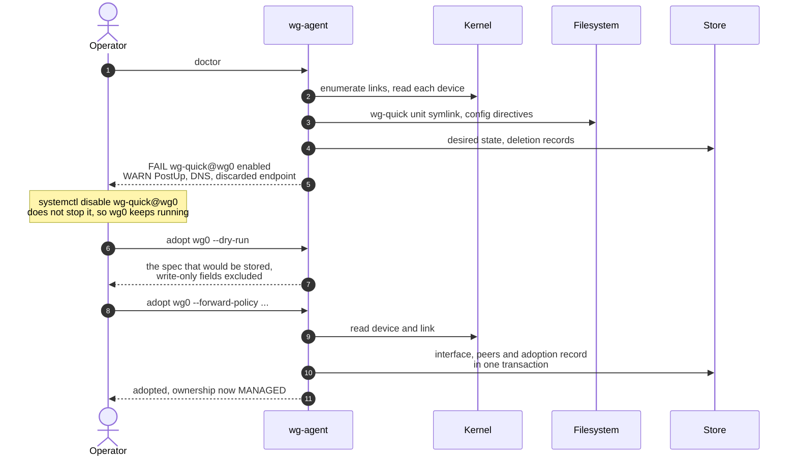

# SPEC-12: Command line surface

## 1. Scope

The subcommands of the `wg-agent` binary: what each one does, how it reaches the store and the
interfaces, how an existing interface is adopted and released, and how the token is issued.

**Not in this module:**
- Configuration keys and the install script → [SPEC-09](SPEC-09-config-deployment.md)
- Token semantics → [SPEC-05](SPEC-05-security.md)
- What each operation does → [SPEC-04](SPEC-04-api-conventions.md) and
  [SPEC-13](SPEC-13-applying-changes.md)
- Export and import behavior → [SPEC-10](SPEC-10-lifecycle.md)

## 2. Subcommands

> **REQ-CLI-001** — The binary MUST provide the subcommands listed below.

| Command | Does |
|---|---|
| `serve` | Run the agent and its API; the systemd unit invokes this |
| `interface create` | CreateInterface |
| `interface list` | ListInterfaces |
| `interface get` | GetInterface |
| `interface update` | UpdateInterface |
| `interface delete` | DeleteInterface |
| `peer add` | CreatePeer — with a generated key pair, prints the client configuration |
| `peer list` | ListPeers |
| `peer get` | GetPeer |
| `peer update` | UpdatePeer |
| `peer remove` | DeletePeer |
| `token rotate` | Replace the token and print the new one |
| `version` | Print the version and the commit |

> **REQ-CLI-002** — Every subcommand other than `serve` MUST act on the store and the
> interfaces directly rather than through the API.

> **REQ-CLI-023** — A subcommand MUST have the effect of the operation it names, with the same
> validation.

Acting directly is what makes the CLI useful before the API exists and on a node whose agent
refuses to start: an operator replacing manual `wg-quick` work needs no daemon to add a peer.
`REQ-RCN-042` keeps the direct write safe beside a running agent — both take the one lock, so they
never write at once. `REQ-CLI-023` is what keeps the two paths one product: the CLI is the API
without the network, over the same code, and acting directly it never handles the token.

The subcommands of section 3 — `doctor`, `adopt` and `release` — and `export`, `import` and
`overview` arrive with the modules that own their behavior; when they do, they join the table of
`REQ-CLI-001`. The [backlog](../60-planning/backlog.md) holds them.

> **REQ-CLI-008** — `serve` MUST accept a flag that runs one reconcile pass and exits.

> **REQ-CLI-009** — A single pass MUST print the ownership, operational state, peer count and
> condition of every interface it saw.

`REQ-CLI-008` is the step between adoption and a supervised agent. Adoption writes desired state
and stops there, so an operator who has just disabled a `wg-quick` unit needs one command that
applies the result and reports what happened, without leaving a process behind. It is the same
pass `REQ-RCN-020` runs at startup, which is what makes the output a rehearsal of what the
running agent will do rather than a separate code path.

`REQ-CLI-009` exists because a pass that printed nothing would leave the operator guessing. The
four fields are the ones that answer whether the migration worked: `REQ-RES-017` ownership says
the interface is managed, `REQ-RES-035` operational state says it is up, and `REQ-RES-032`
condition says whether reconciliation succeeded.

## 3. Adoption

> **REQ-CLI-004** — `doctor` MUST compute the report of `REQ-DIA-040` from the kernel, the
> store and the filesystem directly rather than through the API.

> **REQ-CLI-005** — `doctor` MUST render the `hint` of every finding it prints.

> **REQ-CLI-006** — `adopt` MUST support a preview mode that prints the spec the request would
> store, excluding write-only fields, without writing it.

> **REQ-CLI-007** — `adopt` MUST refuse an interface whose report carries a `FAIL` finding,
> printing the findings.

`REQ-CLI-004` is what makes `doctor` useful before anything is configured: an operator meeting
this agent for the first time runs it on a node where the API has never been reachable, so the
command cannot depend on a listener, a token or a store. `REQ-CLI-005` keeps remediation text in
one home — `REQ-DIA-003` already requires `hint` to name a concrete corrective action, and the
CLI renders it rather than authoring its own wording.

`REQ-CLI-006` excludes write-only fields because the spec adoption stores holds the interface
private key and every preshared key, which `REQ-CLI-022` and `REQ-SEC-050` forbid in output. It
renders the validate-only response of `REQ-API-068` rather than computing the spec a second
time.

The store is named in `REQ-CLI-004` because `REQ-DIA-040` scopes the report to `FOREIGN`
interfaces, and `REQ-RES-017` decides that from desired state — a fact the store holds and the
kernel does not. Reading it directly is the same latitude `REQ-CLI-002` gives the token
subcommands.

The migration this supports costs no downtime. Disabling a `wg-quick` unit does not stop it, so
the interface keeps running while the unit stops competing for the next boot; adoption then
takes over the live link with its key intact.

Step 5 is the one that earns the command. Every finding it reports is a thing an operator would
otherwise discover after adoption: a competing unit at the next reboot, a `PostUp` rule that
disappears with it, an endpoint no longer in desired state.

## 4. Token issuance

> **REQ-CLI-010** — A generated token MUST be drawn from a cryptographically secure source
> with at least 256 bits of entropy.

> **REQ-CLI-011** — A generated token value MUST be printed exactly once, by the command that
> generates it.

> **REQ-CLI-012** — The agent MUST NOT provide any command that prints an existing token
> value.

> **REQ-CLI-013** — A command writing the token file MUST create it with mode `0600` and the
> ownership required by `REQ-SEC-082`.

> **REQ-CLI-014** — A command writing the token file MUST replace it atomically, leaving the
> previous contents intact on failure.

`REQ-CLI-011` and `REQ-CLI-012` together make the token file the only copy, which is what
makes mode `0600` under `REQ-CLI-013` meaningful. `REQ-SEC-085` is what turns a rotation into a
real control: the running agent honours the new token, and refuses the old one, from the next
request, with no signal to deliver. A token drawn from `wg genpsk` meets `REQ-CLI-010`, since
it is 256 bits from the kernel's generator.

## 5. Output

> **REQ-CLI-020** — Every subcommand producing output MUST support `--output json` alongside
> its default human-readable form.

> **REQ-CLI-021** — A failing subcommand MUST exit with a non-zero status and write the
> reason to stderr.

> **REQ-CLI-022** — Human-readable output MUST NOT contain a private key, a preshared key or
> a token value other than one the command itself generated.

The exception is the point of two commands: `token rotate` prints the token it generated, and
`peer add` prints a client configuration holding the private key it generated, each exactly once.
Machine-readable output exists because an operator scripting against a node should not parse a
table.

## 6. Removed requirements

Removed in v2.0 by [ADR-0013](../10-decisions/ADR-0013-drive-wg-and-wg-quick.md) and
[ADR-0015](../10-decisions/ADR-0015-network-listener-with-a-shared-secret.md):

~~**REQ-CLI-003**~~ — A subcommand needing a running agent connecting over the unix socket.
There is no socket, and no subcommand needs the agent running.

~~**REQ-CLI-015**~~ — `token regen` keeping the label and role of the entry it replaces. One
token carries neither.

~~**REQ-CLI-016**~~ — A command modifying the token file signalling the agent. `REQ-SEC-085`
makes the agent honour a replaced token without a signal.

## 7. Open questions

None.
