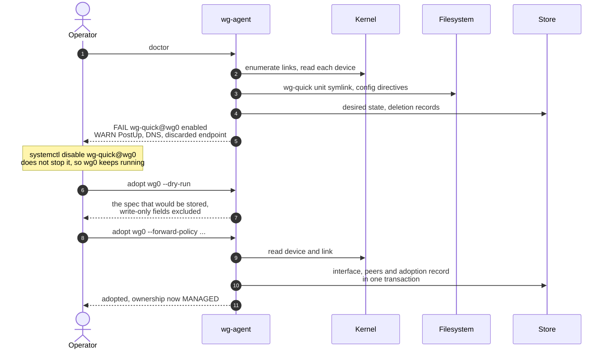

# SPEC-12: Command line surface

## 1. Scope

The subcommands of the `wg-agent` binary: what each one does, which of them need a running
agent, how an existing interface is adopted and released, and how tokens are issued.

**Not in this module:**
- Configuration keys and the install script → [SPEC-09](SPEC-09-config-deployment.md)
- Token semantics and roles → [SPEC-05](SPEC-05-security.md)
- Export and import behavior → [SPEC-10](SPEC-10-lifecycle.md)

## 2. Subcommands

> **REQ-CLI-001** — The binary MUST provide the subcommands listed below.

| Command | Needs a running agent | Purpose |
|---|---|---|
| `serve` | — | Run the agent; the systemd unit invokes this |
| `token add` | No | Issue a token with a role and a label |
| `token list` | No | List labels and roles, never token values |
| `token revoke` | No | Remove a token by label |
| `token regen` | No | Replace the value of an existing token, keeping label and role |
| `export` | No | Export desired state per `REQ-LIF-020` |
| `import` | No | Import desired state per `REQ-LIF-051` |
| `doctor` | No | Print the adoption readiness report from `REQ-DIA-040` |
| `adopt` | Yes | Bring an existing interface under management per `REQ-RCN-060` |
| `release` | Yes | Stop managing an interface, leaving its link running, per `REQ-RCN-069` |
| `overview` | Yes | Print the node overview from `REQ-DIA-020` |
| `version` | No | Print version, commit and Go version |

> **REQ-CLI-002** — Token and state subcommands MUST operate on files directly rather than
> through the API.

Operating on files is what lets an operator issue the first token before the agent has ever
started, and recover a node whose agent refuses to start.

`export` and `import` arrive with [SPEC-10](SPEC-10-lifecycle.md), which owns their behavior
and sits a milestone later than the rest of this module. The commands the install script and
the MVP depend on are `serve`, `token`, `overview` and `version`.

> **REQ-CLI-003** — A subcommand needing a running agent MUST connect over the unix socket.

The unix socket grants `admin` under `REQ-SEC-077`, so the CLI never handles a token to read
the agent's own state.

## 3. Adoption

> **REQ-CLI-004** — `doctor` MUST compute the report of `REQ-DIA-040` from the kernel, the
> store and the filesystem directly rather than through the API.

> **REQ-CLI-005** — `doctor` MUST render the `hint` of every finding it prints.

> **REQ-CLI-006** — `adopt` MUST support a preview mode that prints the spec the request would
> store, excluding write-only fields, without writing it.

> **REQ-CLI-007** — `adopt` MUST refuse an interface whose report carries a `FAIL` finding,
> printing the findings.

`REQ-CLI-004` is what makes `doctor` useful before anything is configured: an operator meeting
this agent for the first time runs it on a node where the API has never been reachable, so the
command cannot depend on a listener, a token or a store. `REQ-CLI-005` keeps remediation text in
one home — `REQ-DIA-003` already requires `hint` to name a concrete corrective action, and the
CLI renders it rather than authoring its own wording.

`REQ-CLI-006` excludes write-only fields because the spec adoption stores holds the interface
private key and every preshared key, which `REQ-CLI-022` and `REQ-SEC-050` forbid in output. It
renders the validate-only response of `REQ-API-068` rather than computing the spec a second
time.

The store is named in `REQ-CLI-004` because `REQ-DIA-040` scopes the report to `FOREIGN`
interfaces, and `REQ-RES-017` decides that from desired state — a fact the store holds and the
kernel does not. Reading it directly is the same latitude `REQ-CLI-002` gives the token
subcommands.

The migration this supports costs no downtime. Disabling a `wg-quick` unit does not stop it, so
the interface keeps running while the unit stops competing for the next boot; adoption then
takes over the live link with its key intact.

Step 5 is the one that earns the command. Every finding it reports is a thing an operator would
otherwise discover after adoption: a competing unit at the next reboot, a `PostUp` rule that
disappears with it, an endpoint no longer in desired state.

## 4. Token issuance

> **REQ-CLI-010** — A generated token MUST be drawn from a cryptographically secure source
> with at least 256 bits of entropy.

> **REQ-CLI-011** — A generated token value MUST be printed exactly once, by the command that
> generates it.

> **REQ-CLI-012** — The agent MUST NOT provide any command that prints an existing token
> value.

> **REQ-CLI-013** — A command writing the token file MUST create it with mode `0600` and the
> ownership required by `REQ-SEC-082`.

> **REQ-CLI-014** — A command writing the token file MUST replace it atomically, leaving the
> previous contents intact on failure.

> **REQ-CLI-015** — `token regen` MUST keep the label and role of the entry it replaces.

> **REQ-CLI-016** — A command modifying the token file MUST signal the running agent to
> reload it, per `REQ-SEC-081`.

`REQ-CLI-011` and `REQ-CLI-012` together make the token file the only copy, which is what
makes mode `0600` under `REQ-CLI-013` meaningful. `REQ-CLI-016` is what turns revocation into
a real control rather than a note to restart the service later.

## 5. Output

> **REQ-CLI-020** — Every subcommand producing output MUST support `--output json` alongside
> its default human-readable form.

> **REQ-CLI-021** — A failing subcommand MUST exit with a non-zero status and write the
> reason to stderr.

> **REQ-CLI-022** — Human-readable output MUST NOT contain a private key, a preshared key or
> a token value, per `REQ-SEC-050`.

Machine-readable output exists because the install script parses the result of `token add`,
and because an operator scripting against a node should not parse a table.

## 6. Open questions

None.
