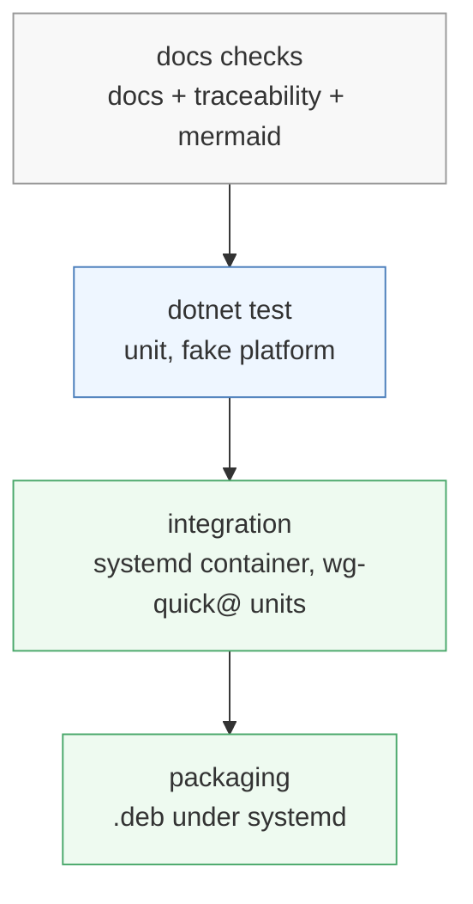

# Running the tests

Tiers, separated by what they need. The rule that keeps the codebase maintainable is that only
the platform adapters need privilege: if a test above that layer asks for root, a seam has
leaked.

| Tier | How | Needs | Covers |
|---|---|---|---|
| Documentation | `docs/check-docs.sh`, `check-traceability.sh`, `check-mermaid.sh` | nothing (mermaid needs Docker) | the docs themselves |
| Unit | `make test` | the .NET SDK | everything above `WgAgent.Platform` |
| Integration | `make test-integration` | the .NET SDK and Docker | the published binary against real `wg`, `wg-quick@` units and peers that handshake |
| Packaging | `make test-packaging` | the .NET SDK and Docker | the `.deb` installed under systemd: the unit, its confinement, the maintainer scripts |



Each tier assumes the one above it passes: a failing unit tier makes an integration failure
uninformative, because the cause could be either layer.

All four tiers run. `make test-integration` publishes the binary self-contained rather than with
NativeAOT, which needs clang, and hands its directory to the tests in `WGAGENT_TEST_BINARY`.
`make test-packaging` builds the real NativeAOT `.deb` in the SDK image, then installs it under
systemd in a container and hands its path in `WGAGENT_DEB`; the packaging tier is where the
NativeAOT binary is exercised.

## Why the integration tier runs systemd

The agent creates an interface by starting `wg-quick@<name>` (`REQ-APL-001`), so a test of that
path needs systemd as PID 1. Docker does not provide one, so the tier runs the distribution's own
systemd inside a privileged container:

```bash
docker run -d --name wgtest --privileged --tmpfs /run --tmpfs /run/lock \
  <image with systemd and wireguard-tools> /lib/systemd/systemd
docker exec wgtest systemctl is-system-running --wait
```

A peer that really handshakes needs a second end. Two network namespaces inside the container,
joined by a veth pair, give the server and a client their own stacks; that arrangement is how
`REQ-APL-005` was measured — a peer added while another pinged every 100 ms, without loss.

Everything a test creates lives in the container's network namespaces, so an interface a test
creates cannot collide with one on your machine.

## Before anything else: the environment

When the first integration test fails, the reason is almost always one of these.

### The kernel module lives on the host

A container shares the host's kernel. Make sure the module is loaded there:

```bash
sudo modprobe wireguard
lsmod | grep wireguard
```

Debian 13 and Ubuntu 24.04 carry it in tree.

### Installing `wireguard-tools` pulls in DKMS

On Debian, `wireguard-tools` recommends `wireguard-dkms`, which drags kernel headers and a
compiler into the image and can stall a build for minutes. Install without recommendations:

```bash
apt-get install -y --no-install-recommends wireguard-tools iproute2 iputils-ping
```

### AppArmor confines `wg` and `wg-quick` to `/etc/wireguard/`

On an Ubuntu 26.04 host, the host's AppArmor profiles for `wg` and `wg-quick` apply inside a
privileged container too, and they allow configuration files only under `/etc/wireguard/`. A test
that writes a client configuration to `/tmp` and runs `wg-quick up /tmp/client.conf` fails with
`Permission denied` even as root. Keep every configuration file of a test — the client's
included — in `/etc/wireguard/`.

### A privileged container is not isolated from the host

It can load kernel modules and write the host's global settings. Keep the integration tier to
what needs it, and never point a test at a path outside the container.

## Writing a test

Name the requirement it verifies. `docs/check-traceability.sh` matches these against the spec,
so the ID has to be exact and use underscores:

```csharp
[Fact]
public void Peer_AddedWithoutDisturbingOthers_REQ_APL_005() { ... }
```

Unit tests live in `WgAgent.Tests` and drive the code over the fake platform in
`WgAgent.Testing` rather than over `wg` and `systemctl`. That is what lets validation, rendering
and the apply decisions of SPEC-13 run in milliseconds without privilege.

An integration test that runs the real tools lives in `WgAgent.IntegrationTests` instead, so the
unit project stays privilege-free.

### Integration tests share one container

Every test in the container sees the same systemd and the same `/etc/wireguard/`. Two tests
creating and deleting interfaces at once make one read a unit the other is stopping. Run the tier
without cross-test parallelism, and give each interface a name no other test uses, so a failure is
a race you can reproduce rather than one test deleting another's interface.

## What the tiers prove, phase by phase

| Phase | Proven in | By |
|---|---|---|
| P1 | Unit and integration | Every requirement of SPEC-01, SPEC-03, SPEC-06, SPEC-07 and SPEC-13 has a test; the exit criteria of the [roadmap](../60-planning/roadmap.md) run in the integration tier |
| P2 | Unit and integration | The contract test compares the server with `api/openapi.yaml`; every route answers with and without the token |
| P3 | Packaging | The `.deb` installs, the agent's interfaces survive a restart of the container and the package's removal, and the unit's confinement holds under Debian 13's and Ubuntu 24.04's systemd |

## After a reboot

Nothing in the agent restores an interface at boot. Its `wg-quick@` unit is enabled
(`REQ-APL-004`), so systemd brings it up whether or not the agent runs. The integration tier checks
exactly that: it restarts the container and asserts that every enabled interface is up with its
peers, before starting the agent at all.
