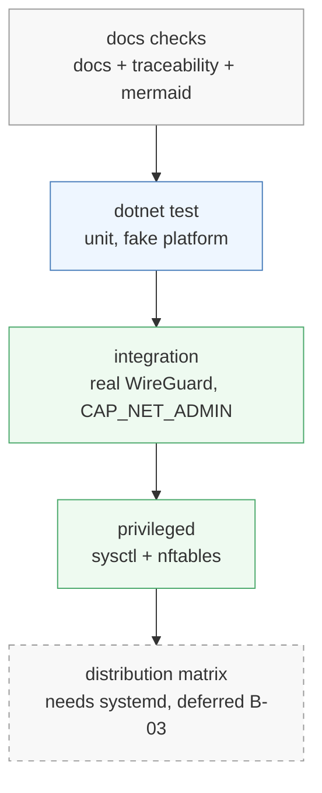

# Running the tests

Tiers, separated by what privilege they need. The rule that keeps the codebase
maintainable is that only the platform adapters need privilege: if a test above that layer asks
for root, a seam has leaked.

| Tier | How | Needs | Covers |
|---|---|---|---|
| Documentation | `docs/check-docs.sh`, `check-traceability.sh`, `check-mermaid.sh` | nothing (mermaid needs Docker) | the docs themselves |
| Unit | `dotnet test tests/WgAgent.Tests` | the .NET SDK | everything above `WgAgent.Platform` |
| Integration | `WgAgent.IntegrationTests` in a container | Docker | real WireGuard through netlink |
| Privileged | the privileged subset of `WgAgent.IntegrationTests` | Docker | the forwarding sysctl, and the nftables table under B-04 |



Each tier assumes the one above it passes: a failing unit tier makes an integration failure
uninformative, because the cause could be either layer.

The unit tier runs today. It drives `WgAgent.Core` — store, reconcile, validation — over the
in-memory platform in `WgAgent.Testing`, so it needs no kernel and no privilege:

```bash
dotnet test tests/WgAgent.Tests
```

The container harness for the integration and privileged tiers is being rebuilt for .NET, and
tracked with the netlink adapter it exercises: no `WgAgent.Platform.Linux` means nothing for an
integration test to drive. The requirements those tiers verify, and the traps they set, are
recorded below so the harness is written against them rather than rediscovering them.

## Before anything else: the environment

An integration test reaches the kernel through two netlink families — generic netlink for the
device and its peers, rtnetlink for the link, its addresses and its routes. A probe that
creates a WireGuard interface, configures it, reads the key and every peer back, and deletes it
exercises the library boundary [architecture.md](../00-overview/architecture.md) describes and
the adoption read `REQ-RCN-061` and `REQ-RCN-062` depend on.

When the probe fails, no test above it can pass, and the reason is almost always one of the two
below.

### The kernel module lives on the host

A container cannot load `wireguard`. Load it on the host:

```bash
sudo modprobe wireguard
lsmod | grep wireguard
```

Kernel 5.6 and later carry the module in tree. On anything older, install
`wireguard-dkms` first.

### The container needs `CAP_NET_ADMIN`

Creating a link without it fails with `operation not permitted`. The integration container runs
with `--cap-add=NET_ADMIN`.

## Why a container rather than a bare network namespace

Both work, and the container is preferred for three reasons.

The container gets its own network namespace, so an interface a test creates cannot collide
with one that matters on your machine. Test code never has to create or clean up a namespace.

It pins the userspace. `wg` and `ip`, used to set up and inspect state around the code under
test, come from the image at known versions, so a failure is a failure of the code rather than
of whatever the host happens to have installed.

It carries the .NET SDK, so a contributor needs Docker and nothing else.

## What the privileged tier is for, and why it is separate

Docker mounts `/proc/sys` read-only. Every requirement that writes a sysctl —
`REQ-FWD-020`, `REQ-FWD-022`, `REQ-FWD-024`, `REQ-FWD-025` — therefore fails in an ordinary
container, as does the `nft` table of `REQ-FWD-010`. Those tests carry a `privileged` trait and
run in a privileged container.

Keep them separate and keep them few. A privileged container is not isolated from the host: it
can write the host's global `net.ipv4.ip_forward`, which `REQ-FWD-021` forbids the agent from
touching at all.

Two traps worth knowing before you write an assertion in this tier.

Docker enables forwarding in its containers, so `net.ipv4.conf.<iface>.forwarding` starts at
`1` there, while a freshly booted host usually starts at `0`. A test for `REQ-FWD-020` or
`REQ-FWD-024` has to set the baseline it expects rather than assume one — otherwise the write
it means to verify is skipped as already-matching and the test asserts nothing.

`wg set <iface> private-key <path>` fails in a privileged container with `fopen: Permission
denied`, for any path and as root, while the same call from a `CAP_NET_ADMIN` container
succeeds. Pipe the key to `/dev/stdin` instead; that works in both tiers, and it keeps a
private key off the filesystem. Only the `wg` binary is affected — ordinary file reads work,
which the store's own tests confirm in the same tier. The product code never reads a key file:
it configures the device through generic netlink.

## Writing a test

Name the requirement it verifies. `docs/check-traceability.sh` matches these against the spec,
so the ID has to be exact and use underscores:

```csharp
[Fact]
public void ForwardPolicy_IntraDeny_REQ_FWD_012() { ... }
```

Unit tests live in `WgAgent.Tests` and drive the code over the fake platform in
`WgAgent.Testing` rather than the kernel. That is what lets the whole reconcile algorithm of
`REQ-RCN-022` — drift, adoption, orphan handling — run in milliseconds without privilege.

An integration test that touches the kernel lives in `WgAgent.IntegrationTests` instead, so the
unit project stays privilege-free. The privileged subset carries a trait so a plain integration
run skips it.

### Integration tests share one network namespace

Every test in the container sees the same network namespace. Two tests creating and deleting
WireGuard links at the same time make one enumerate a device that is gone by the time it reads
it. Run the integration tier without cross-test parallelism, and give each link a name no other
test uses, so a failure is a race you can reproduce rather than one test deleting another's
interface by name.

## Taking over a node by hand

The integration tier does this in a container, and the same sequence works on a real node:

```bash
sudo wg-agent doctor                       # what blocks adoption, and how to clear it
sudo systemctl disable wg-quick@wg0        # disable does not stop: wg0 keeps running
sudo wg-agent adopt wg0 --dry-run \
     --intra=allow --inter=deny --external=deny --manage-routes=false
sudo wg-agent adopt wg0 \
     --intra=allow --inter=deny --external=deny --manage-routes=false
sudo wg-agent serve --once                 # apply desired state, print what each interface is
sudo wg-agent doctor                       # wg0 now reports MANAGED
sudo wg-agent release wg0                  # and back to FOREIGN, link untouched
```

The policy flags are required rather than defaulted. The kernel holds no forward policy, so a
default would be a guess applied to traffic that is already flowing — see `REQ-RCN-066`.

### Something has to run after a reboot

Disabling the `wg-quick` unit removes the one thing that recreated the interface at boot.
`wg-agent serve` is what replaces it: the startup pass of `REQ-RCN-020` recreates the link,
restores the key, the peers, the addresses and the MTU, and brings it up. The integration tier
runs exactly that — adopt, delete the link, one pass, assert the interface is back with the same
public key — so the claim is checked on every change.

The systemd unit that starts `serve` at boot is packaging work, deferred under `B-03`. Until it
ships, either start `serve` under a supervisor of your own or run it in a terminal:

```bash
sudo wg-agent serve --log-level=debug
```

Two things it does not do while B-04 stands. It serves no API, so an interface changes only
through `adopt`, `release` and the store; and it writes no forwarding sysctl beyond `REQ-FWD-020`
and installs no nftables rules, because step 10 of `REQ-RCN-022` is deferred. A
single-interface node does not need them. A node routing between two does.

`serve` holds an exclusive lock on the store while it runs — `REQ-RCN-006` — so `adopt` and
`release` refuse to write until it stops. Stop it with `SIGTERM`; `REQ-API-074` requires
shutdown to leave every managed interface exactly as it is, so stopping the agent is not
stopping the tunnel.

## The distribution matrix

`REQ-CFG-013` requires the systemd hardening combination to be verified on every tested
distribution. Docker does not serve that tier: the assertion is about `systemd` unit directives,
which need systemd running as PID 1. Use a virtual machine or a CI runner per distribution.
That work sits with packaging, deferred under `B-03` in the
[backlog](../60-planning/backlog.md).
